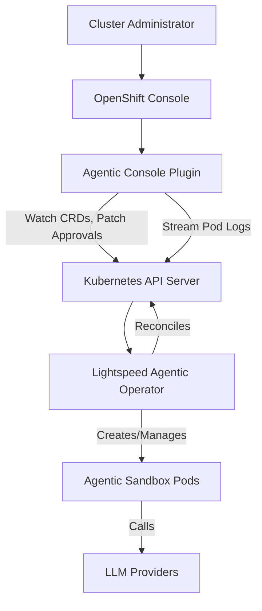
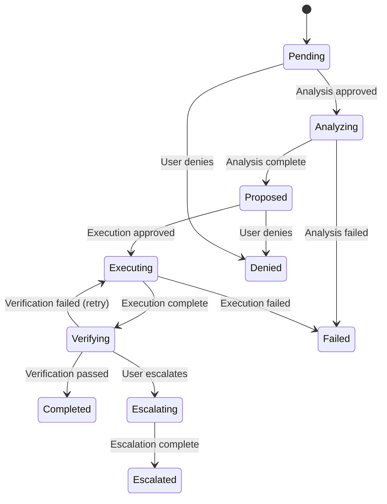
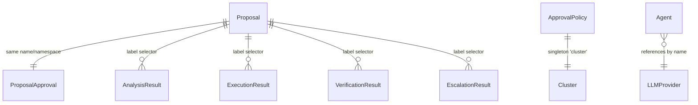
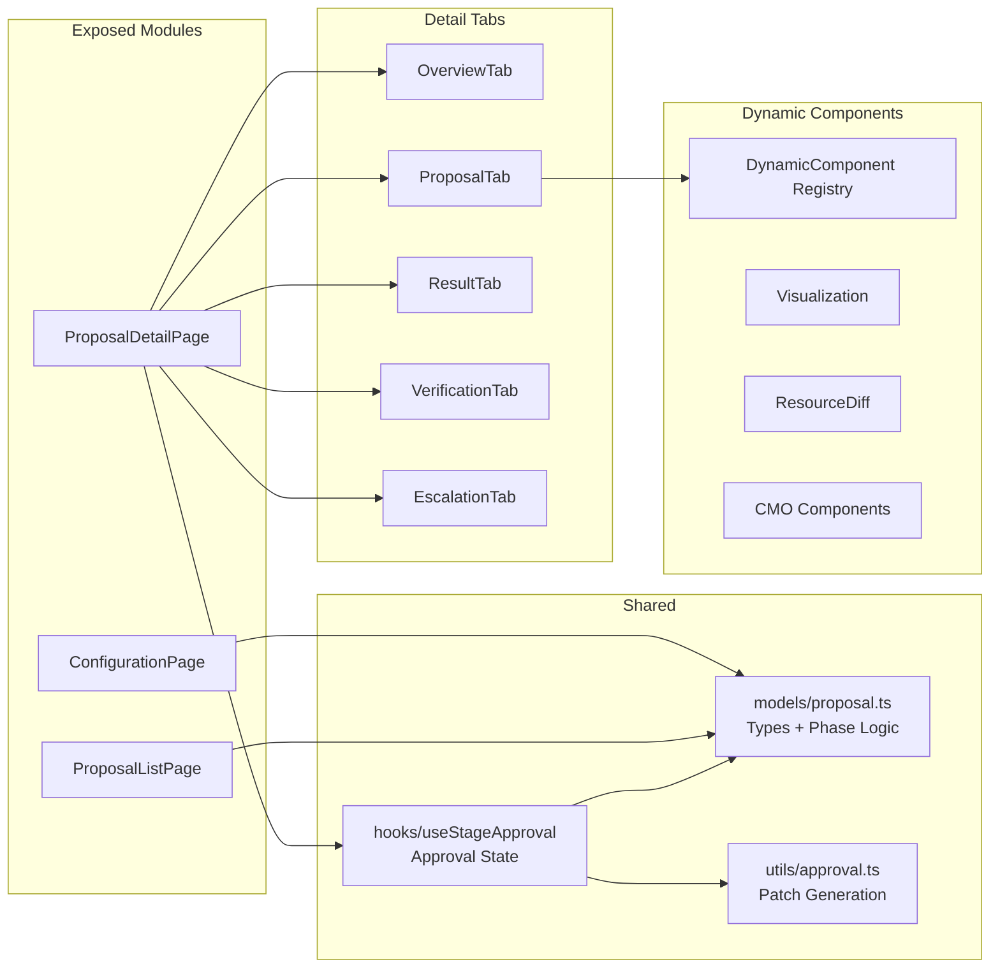

# Architecture

The OpenShift Lightspeed Agentic Console Plugin is a React-based dynamic plugin that extends the OpenShift Console with a UI for managing AI-driven cluster operation proposals.

## System Context

The plugin runs inside the OpenShift Console via webpack module federation. It does not have its own backend — it communicates directly with the Kubernetes API (for CRD operations) and proxies requests to the Lightspeed service through the console's plugin proxy mechanism.

## Proposal Workflow

A proposal moves through a multi-stage lifecycle. The plugin renders each stage and gates progression on human approval decisions.

## CRD Relationships

The plugin operates on a set of CRDs in the `agentic.openshift.io/v1alpha1` API group. Each proposal has a companion ProposalApproval CR and is linked to Result CRs by label selectors.

## Plugin Architecture

The plugin is structured around three exposed modules, each a top-level page component. Shared logic lives in models, hooks, and utility modules.

## Key Architectural Decisions

**Hand-written CRD types** — Types in `models/proposal.ts` are manually maintained rather than auto-generated from the CRD OpenAPI schema. This was a pragmatic choice for early development velocity but creates a synchronization burden with the operator. A TODO exists to migrate to auto-generation.

**Phase derived from conditions** — The proposal phase is not stored as a field; it's derived from `status.conditions[]` using the same algorithm as the operator. This ensures the console and operator always agree on phase, but the derivation function (`derivePhaseFromConditions`) must be kept in sync.

**Result CRs as separate resources** — Step outputs (analysis options, execution actions, verification checks) live in their own CRDs rather than inline on the Proposal status. This keeps the Proposal CR lightweight and allows independent lifecycle management. The plugin discovers them via label selectors and correlates via `status.steps.<stage>.results[]` references.

**Dynamic component registry** — Adapter-defined UI components use a type-dispatch pattern rather than a plugin-within-a-plugin system. The set of known types is hardcoded; adding a new component type requires code changes in the console plugin.
